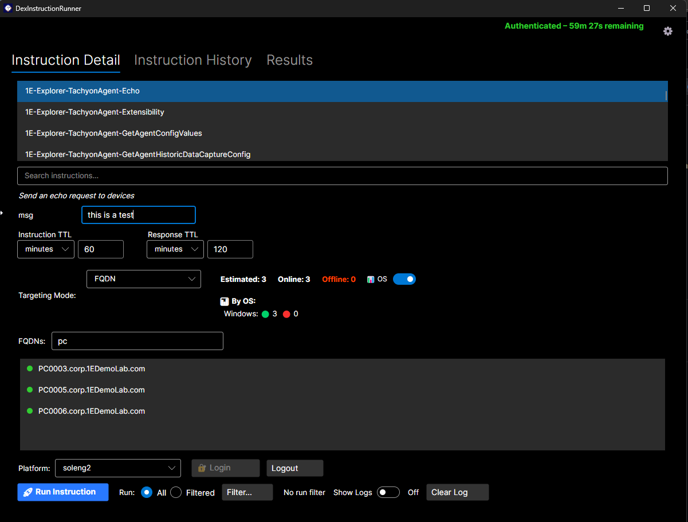

# DexInstructionRunner

> **Disclaimer:**  
> This project is provided *as‑is* and is intended only as a sample application to help you get started with building your own TeamViewer DEX instruction runner.  
> No warranties, guarantees, or support are provided.

A minimal, focused desktop utility to **browse, run, and monitor TeamViewer DEX instructions** against one or more endpoints. Designed for simplicity, speed, and “operator‑first” workflows.

> **What is TeamViewer DEX?**  
> TeamViewer DEX provides proactive endpoint monitoring and automated remediation (digital employee experience). This utility focuses on the *instruction* execution slice—list, parameterize, run, and review results. [1](https://www.teamviewer.com/en/products/dex/)


---

## Features

- 🔎 **Instruction discovery** — Load instructions (and packs) from your DEX tenant; filter by name, tag, category.
- 🧩 **Parameter editor** — Auto‑render typed parameters with validation + sensible defaults.
- 🖥️ **Target selection** — Choose device or  list up to 10 fqdn's.
- ▶️ **Run & monitor** — Fire instructions, stream progress, and show success/error per target.  
- 🧾 **Results export** — Save results to CSV, TSV or XLSX;  

> For broader DEX content (packs, instructions, SCALE code) and how organizations structure it, see the TeamViewer DEX/Exchange content model.)

---

## How it Works (High level)

1. **Connect** — The app authenticates to your DEX endpoint using your interactive credentials.  
2. **Load content** — Instructions are retrieved from the endpoint and cached for the session.  
3. **Parameterize** — When you select an instruction, a typed form is generated for parameters if they exist or populate a dropdown for a list of options.  
4. **Target** — Pick devices (or paste a list).  
5. **Run** — The app dispatches runs and tracks per‑target state until completion.  
6. **Review** — Summaries and raw payloads are available for export/audit.


---

## Getting Started

### Prerequisites

- **OS:** Windows/macOS  
- **Runtime:** **.NET 8 SDK** (for build) and the platform runtime for your chosen UI framework *(Avalonia or WPF; this project uses Avalonia by default — adjust if yours differs).*  


### Clone & Build

```bash
git clone https://github.com/teamviewer/DexInstructionRunner.git
cd DexInstructionRunner
# If Avalonia:
dotnet restore
dotnet build -c Release
# Optional: publish self-contained binary (adjust RID)
dotnet publish -c Release -r win-x64 --self-contained false
