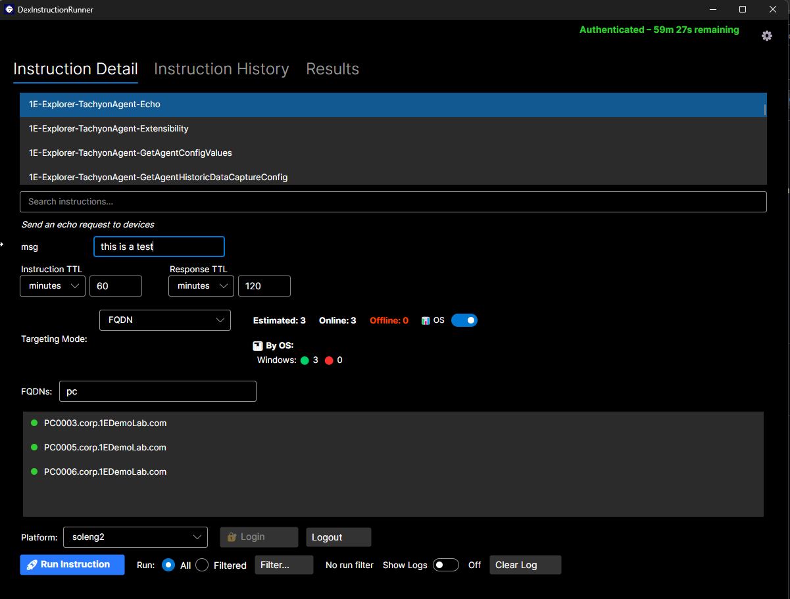

DexInstructionRunner

Disclaimer:
This project is provided as-is and is intended only as a sample application to help you get started with building your own TeamViewer DEX instruction runner.
No warranties, guarantees, or support are provided.

A focused desktop utility to browse, run, and monitor TeamViewer DEX instructions against explicitly selected endpoints.
The application emphasizes safe targeting, fast execution, and operator-friendly workflows.

What is TeamViewer DEX?
TeamViewer DEX provides proactive endpoint monitoring and automated remediation (digital employee experience). This utility focuses on the instruction execution workflow—discover, parameterize, run, and review results. 1

Features
🔎 Instruction discovery

Load instructions (and packs) directly from your DEX tenant.

Filter instructions by:

name

category

tags

description

This allows quick discovery of relevant instructions in large environments.

🧩 Dynamic parameter editor

When an instruction is selected, the application automatically generates a typed parameter form.

Features include:

automatic parameter detection

dropdowns for enumerated values

validation for required fields

default value population

This allows instructions to be run without manually constructing payloads.

🖥️ Safe FQDN-based targeting

Devices are primarily targeted using explicit FQDN selection.

Capabilities include:

FQDN device search

Primary user search

controlled device selection

maximum of 10 devices per execution

This model helps prevent accidental large-scale instruction execution.

▶️ Run & monitor instructions

Instructions can be executed directly from the UI.

The runner provides:

real-time execution status

per-device success or failure state

error visibility and diagnostics

Execution progress is streamed back to the interface for immediate feedback.

🧾 Results export

Instruction results can be exported for analysis or reporting.

Supported formats:

CSV

TSV

XLSX

Exports can be configured with row limits and default formats from the settings panel.

⚙️ Built-in configuration panel

The application includes a settings flyout for runtime configuration.

Available options include:

dev token reuse

API troubleshooting logging

authentication refresh threshold

result display limits

export row limits

default export format

platform configuration

🌐 Platform management

Multiple DEX platforms can be configured directly within the application.

Features include:

platform aliases

default platform selection

secure platform URL handling

inline platform editing

This allows users to quickly switch between environments.

How it Works (High Level)

Connect
The application authenticates to the DEX platform using interactive credentials.

Load Instructions
Available instructions are retrieved from the platform and cached for the session.

Parameterize
When an instruction is selected, a typed parameter form is generated automatically.

Select Targets
Devices are selected using FQDN search or explicit device selection.

Run Instruction
The application dispatches the instruction and tracks execution status per device.

Review Results
Results are displayed in the UI and can be exported for further analysis.

Getting Started
Prerequisites

OS: Windows or macOS

Runtime: .NET 8 SDK (for build)

Framework: Avalonia UI (cross-platform desktop UI)

Clone & Build
git clone https://github.com/teamviewer/DexInstructionRunner.git
cd DexInstructionRunner

dotnet restore
dotnet build -c Release

Optional publish:

dotnet publish -c Release -r win-x64 --self-contained false

Adjust the runtime identifier for your platform if needed.
